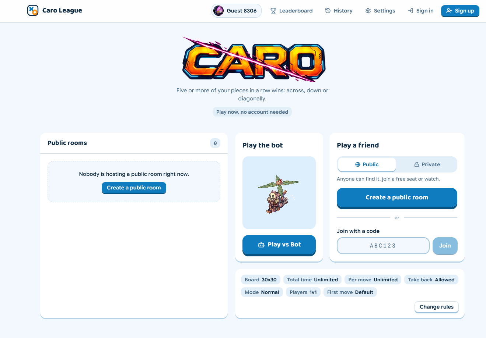
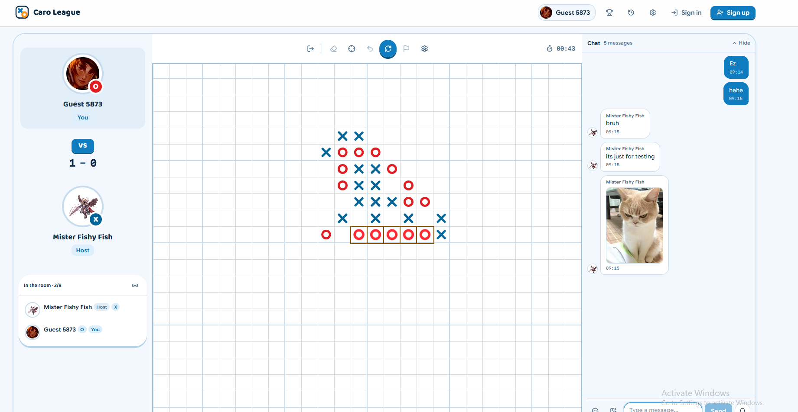
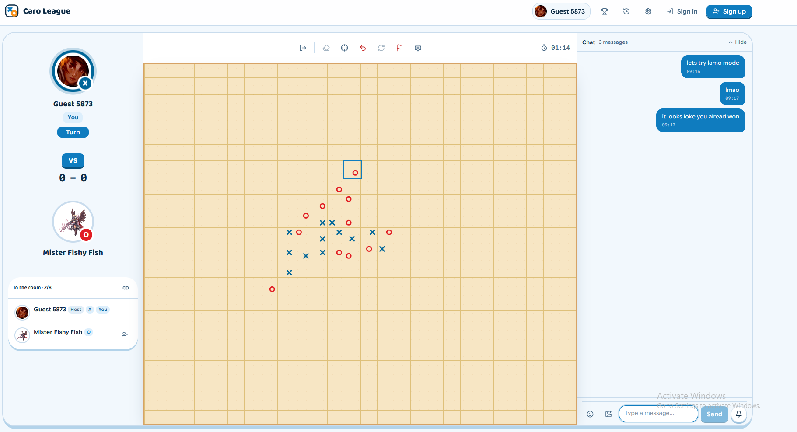

# [Caro Web App](https://league-of-caro.vercel.app/)

[](https://nodejs.org/)
[](https://react.dev/)
[](https://www.typescriptlang.org/)
[](https://tailwindcss.com/)
[](https://supabase.com/)
[](https://peerjs.com/)
[](https://vitest.dev/)

A real-time **Caro (Gomoku / Five-in-a-Row)** web application built with **React 19**, **TypeScript**, **Tailwind CSS v4**, and **WebRTC (PeerJS)**. Players meet in peer-to-peer rooms, while **Supabase** handles accounts, ELO ratings, match history, and the leaderboard.

---

## Features

### Game modes
- **1v1 Classic**: five in a row wins
- **1v1v1**: three players with a triangle piece, four in a row wins
- **Lmao mode**: each mark lands in one of nine corners of its cell
- **Practice**: play against a bot, in two-player or three-player form
- **Board sizes** of 15, 19, 30 and 50, with total-time and per-move clocks (or unlimited time)
- **Coin flip and Stone Paper Scissors**: retro arcade pre-match turn deciders

### Rooms
- **Open rooms** with seats, viewers and a host hub, joined by room code or from the public room list
- **Take a seat** mid-room: viewers can sit down when a seat opens
- **Host controls**: update rules, kick a member, clear a seat
- **Reconnection**: a dropped player keeps their seat for up to five hours and resumes where they left off
- **Claim a win**: if an opponent stays gone for two minutes, the remaining player can end the game as a win
- **Per-player clocks** and accumulated thinking time for each seat
- **Take-backs**: instant within five seconds of your own move, otherwise your opponent has to agree

### Double down
- Either player can offer a **Double down** once per game, from the orange dice button next to the settings gear
- The offer appears in the chat with **Accept** and **Reject**. Rejecting changes nothing and the game carries on
- The player receiving the offer has five of their own moves to answer; after their fifth move, it is automatically rejected
- When accepted, the dice **burns** for the rest of the game, and the winner gains and the loser loses an extra **20 rating points**
- The bonus is applied on the server and only when both players agreed through their own signed-in session, so nobody can impose it on the other
- Available in online 1v1 games; not shown to viewers, in practice mode, or in 1v1v1

### Chat
- Live room chat with **reply and quote** (tap a quote to jump to the original message)
- Image, meme and GIF attachments
- Quick reactions, a buzz, and a tease that targets a player
- Sound and unread indicators

### Ratings and ranks
- **ELO rating** (K-factor 32) computed on the server, never by the client
- **Rank tiers with badges**: Stone, Wood, Bronze, Silver, Gold, Diamond, Platinum, Uranium, Master and Grand Master, shown in the navbar, profiles and leaderboard
- **Leaderboard** with a rank guide that explains each tier
- **Match history** and a profile with stats and avatar selection
- **Tamper-resistant results**: a result that favours the reporting player is held as a claim, recorded after ten minutes unless disputed, and only if both players held a seat ticket for the game

### Connectivity and VPN support
- Peers connect directly over WebRTC, falling back to a **TURN relay** when a direct path is not possible
- **Works behind VPNs and strict networks** (such as Cloudflare 1.1.1.1 / WARP): the relay is reachable over TLS on port 443
- Short-lived credentials are issued by the `/api/turn` serverless function using a **Cloudflare TURN** key, so the API token stays on the server and never ships in the bundle
- A static TURN relay can be used instead (see [Environment variables](#3-configure-environment-variables))

### Interface
- Coordinates, move simulations, display preferences (coordinates, last-move marker, sound)
- Board themes (graph paper, light wood, classic wood, laser), piece styles and custom piece colours
- Light and dark appearance that follows your system setting
- Responsive layout down to 320px phones, with a modal chat sheet on mobile
- Respects `prefers-reduced-motion`

---

## Preview







---

## Quick Start

### 1. Prerequisites
- [Node.js](https://nodejs.org/) 20.19 or higher
- `npm` or `pnpm`

### 2. Clone and Install Dependencies
```bash
git clone https://github.com/voanhduy1710/Caro-app.git
cd Caro-app
npm install
```

### 3. Configure Environment Variables
Copy the example environment file and fill in your credentials:
```bash
cp .env.example .env
```
Edit `.env`:
```env
# Optional Vercel token for CLI deployment
VERCEL_ACCESS_TOKEN=your_vercel_token_here

# Supabase Project Configuration
VITE_SUPABASE_URL=https://your-project-id.supabase.co
VITE_SUPABASE_ANON_KEY=your_supabase_anon_key_here

# Cloudflare TURN (recommended, for players on VPNs or strict NATs).
# Dashboard > Realtime > TURN Server > create key. Server-side secrets read by api/turn.js.
CLOUDFLARE_TURN_KEY_ID=
CLOUDFLARE_TURN_API_TOKEN=

# Alternative: a static TURN relay that listens on TLS/TCP 443.
# Comma-separated URLs, e.g. turns:turn.example.com:443?transport=tcp,turn:turn.example.com:3478
VITE_TURN_URLS=
VITE_TURN_USERNAME=
VITE_TURN_CREDENTIAL=
```
Without any TURN setting the app still works, but players on VPNs or behind strict networks may fail to connect to each other.

### 4. Run Locally
Start the development server:
```bash
npm run dev
```
Open [http://localhost:5175](http://localhost:5175) in your browser.

---

## Deployment

The app has two parts that are deployed separately.

**Frontend and `/api/turn` (Vercel)**

```powershell
.\deploy_vercel.ps1
```
It syncs the Supabase and TURN settings to the Vercel project, runs a production build check, and publishes with the CLI.

**Database and edge functions (Supabase)**

Apply the SQL files in `supabase/migrations/` in order, and deploy the functions in `supabase/functions/`:

```bash
npx supabase functions deploy seat-ticket submit-match --project-ref <your-project-ref>
```

The CLI needs to be logged in (`npx supabase login`, or the `SUPABASE_ACCESS_TOKEN` environment variable) with an account that is a member of the project.

---

## PowerShell Helper Scripts

For Windows developers, automated PowerShell workflows are provided in the repository root:

- **`.\deploy_local.ps1`**: Installs dependencies (if missing) and starts the Vite dev server on strict port `5175`.
- **`.\clean_restart.ps1`**: Gracefully terminates any orphaned process holding port `5175` before launching a fresh dev instance.
- **`.\deploy_vercel.ps1`**: Syncs environment variables, runs a production build check (`npm run build`), and publishes to Vercel via CLI token.

---

## Testing & Code Quality

```bash
# Run unit tests via Vitest
npm test

# Run the Room Engine headless E2E simulation suite
npm run e2e:room

# Run fast linter checks via Oxlint
npm run lint

# Check TypeScript types and build bundle
npm run build
```

---

## Project Structure

```text
Caro-app/
├── api/                  # Vercel serverless functions (TURN credentials)
├── public/               # Static assets, sound effects, avatars, rank badges & minigame sprites
├── scripts/              # E2E room tests and data maintenance scripts
├── src/
│   ├── app/              # Root App, View routing & layout wrappers
│   ├── config/           # Application & Supabase client configuration
│   ├── features/
│   │   ├── auth/         # Supabase Auth provider, modals & credentials management
│   │   ├── avatar/       # Avatar selection & storage bucket integration
│   │   ├── game/         # Board, controls, action rail, chat & AI engine
│   │   ├── history/      # Match history, rated result submission & claims
│   │   ├── leaderboard/  # ELO leaderboard, rank guide & rank tracking
│   │   ├── minigames/    # Retro Coin Flip & Stone RPS pre-match turn deciders
│   │   ├── profile/      # Player profile modal & stat editor
│   │   ├── room/         # P2P room engine, protocol, host hub, ratings & roster
│   │   ├── settings/     # Room settings & board theme preferences
│   │   ├── theme/        # Theme provider & UI theme switches
│   │   └── webrtc/       # PeerJS connection orchestration, ICE servers & room discovery
│   ├── shared/           # Reusable UI components, hooks, sound triggers & utilities (ELO, rank tiers)
│   ├── styles/           # Tailwind CSS v4 design tokens, motion and global themes
│   └── main.tsx          # Application entry point
├── supabase/
│   ├── functions/        # Edge functions: submit-match, seat-ticket
│   └── migrations/       # SQL migrations (RLS, seat tickets, claims, double down)
└── package.json          # Project metadata and dependencies
```
